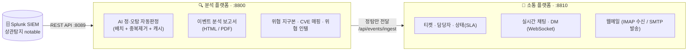

<div align="center">

# 🛡️ JANUS SOC Platform

**SIEM 연동 · AI 정·오탐 자동판정 · 티켓 기반 협업까지 잇는 통합 보안관제(SOC) 플랫폼**

Splunk가 탐지한 보안 이벤트를 **AI(LLM)가 자동으로 정탐/오탐 판정**하고,
**정탐만** 소통 플랫폼으로 전달해 관제 요원이 **티켓 기반으로 즉시 대응**하는 End-to-End 관제 워크플로우.

<br/>


</div>

---

## 📖 개요

**JANUS SOC Platform**은 두 개의 웹 애플리케이션으로 구성된 보안관제 자동화 프로젝트입니다.

| 플랫폼 | 포트 | 역할 |
|:--|:--:|:--|
| 🔍 **분석 플랫폼** (Analysis) | `8800` | Splunk 연동 · AI 정·오탐 판정 · 이벤트 분석 보고서 · 위협 시각화 |
| 💬 **소통 플랫폼** (Communication) | `8810` | 정탐 티켓 관리 · 실시간 협업(채팅/DM) · 웹메일 |

> 개별 이벤트를 사람이 일일이 보던 관제 업무를, **AI 1차 판정 + 티켓 자동화**로 전환해 대응 속도와 일관성을 높이는 것을 목표로 합니다.

---

## 🏗️ 아키텍처



---

## ✨ 주요 기능

### 🔍 분석 플랫폼 (`:8800`)
- **Splunk 상관탐지(notable) 수집** — REST API 연동
- **AI 자동 정·오탐 판정** — OpenRouter(LLM) 기반, *중복제거 + 배치 + 캐시*로 토큰 비용 절감
- **이벤트 분석 보고서** — HTML/PDF 자동 생성 (Jinja2 + Chromium)
- **🌐 3D 위협 지구본** — 공격 출발지 → 관제센터 흐름 시각화 (react-globe.gl)
- **CVE 매핑**(NVD) · **위협 인텔**(AbuseIPDB · OTX) · **위협 트렌드/인사이트**
- **정탐 자동 전달** — 판정된 정탐을 소통 플랫폼으로 push

### 💬 소통 플랫폼 (`:8810`)
- **정탐 티켓 자동 수신**(ingest) 및 티켓 · 담당자 · 상태(SLA) 관리
- **이벤트 이력 · 코멘트 · 태스크 · IOC**
- **💬 실시간 채팅(채널) · DM** — WebSocket
- **📧 웹메일** — 사용자별 IMAP 수신 / SMTP 발송 / 회신(In-Reply-To 스레딩)

---

## 🧰 기술 스택

| 영역 | 사용 기술 |
|:--|:--|
| **Backend** |     |
| **DB / ORM** |   |
| **Frontend (분석)** | -61DAFB?logo=react&logoColor=black)  |
| **Frontend (소통)** |    |
| **AI / LLM** |  `google/gemini-2.5-flash` · `json-repair` |
| **연동** |  NVD · AbuseIPDB · OTX · IMAP/SMTP |
| **실시간 / 보고서** |  Jinja2 + Chromium(headless PDF) |

---

## 📂 폴더 구조

```
janus-soc-platform/
├── analysis-platform/          # 🔍 분석 플랫폼 (:8800)
│   ├── backend/                # FastAPI — main.py, triage_service, gemini_service, splunk_client ...
│   ├── frontend/               # React (CRA)
│   └── .env.example
└── comm-platform/              # 💬 소통 플랫폼 (:8810)
    ├── backend/                # FastAPI — main.py, routers/, mail_gateway ...
    ├── frontend/               # React (Vite)
    └── .env.example
```

---

## 🚀 시작하기

> 아래는 **분석 플랫폼** 기준입니다. 소통 플랫폼은 경로를 `comm-platform`, 포트를 `8810`으로 바꿔 동일하게 진행하세요.

### 1️⃣ 백엔드
```bash
cd analysis-platform/backend
python -m venv .venv
# Windows: .venv\Scripts\activate   |   Linux/Mac: source .venv/bin/activate
pip install -r requirements.txt

cp ../.env.example ../.env          # .env 값 채우기 (Splunk · API 키 등)
uvicorn main:app --host 0.0.0.0 --port 8800     # 소통 플랫폼은 --port 8810
```

### 2️⃣ 프론트엔드 (백엔드가 정적 서빙)
```bash
cd analysis-platform/frontend
npm install
npm run build      # 분석 = build/ · 소통 = dist/ 를 백엔드가 서빙
```
→ 브라우저에서 **http://localhost:8800** (소통 **http://localhost:8810**) 접속

---

## ⚙️ 환경변수

`*/.env.example`를 복사해 `.env`로 만들고 값을 채우세요.

| 플랫폼 | 키 | 설명 |
|:--|:--|:--|
| 분석 | `SPLUNK_HOST` · `SPLUNK_PORT` · `SPLUNK_USERNAME` · `SPLUNK_PASSWORD` | Splunk REST 연동 |
| 분석 | `GEMINI_API_KEY` · `GEMINI_MODEL` | OpenRouter(LLM) 판정 · 보고서 |
| 분석 | `ABUSEIPDB_API_KEY` · `OTX_API_KEY` | 위협 인텔 (선택) |
| 분석 | `COMM_PLATFORM_URL` | 정탐 전달 대상(소통 플랫폼) |
| 분석 | `SOC_MOCK` | `true` 면 목데이터로 오프라인 구동 |
| 소통 | `MAIL_GATEWAY_HOST` · `MAIL_IMAP_PORT` · `MAIL_SMTP_PORT` | 메일 게이트웨이 |

---

## 🔒 보안 주의
- **`.env`(시크릿)는 절대 커밋 금지** — `.gitignore`로 제외되며, 저장소에는 값이 비워진 `.env.example`만 포함됩니다.
- AI 판정/보고서는 **OpenRouter(외부 API)** 를 사용합니다. 폐쇄망에서는 방화벽 허용 또는 **로컬 LLM** 적용이 필요합니다.
- 사용자 계정 · 메일 비밀번호가 담기는 런타임 DB(`storage/*.db`)도 커밋 대상에서 제외됩니다.

---

<div align="center">

**JANUS 보안관제팀(SOC)** · SOC 관제 실습/데모 프로젝트

</div>
